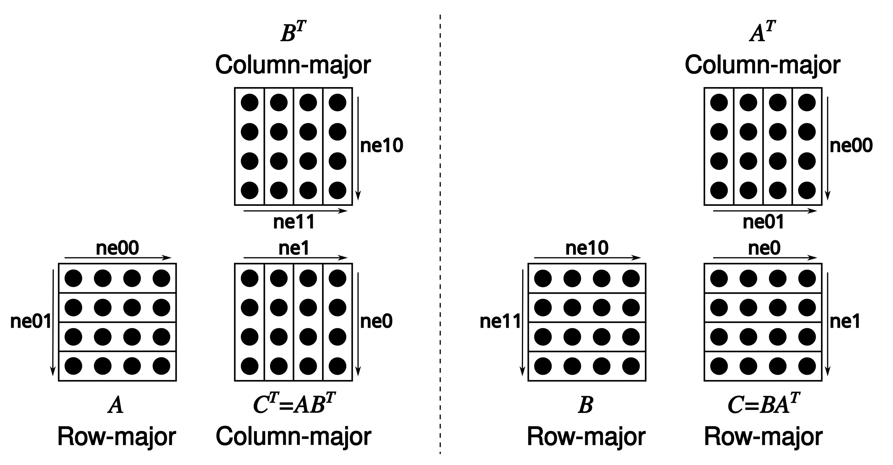

# Contributors

The project differentiates between 3 levels of contributors:

- Contributors: people who have contributed before (no special privileges)
- Collaborators (Triage): people with significant contributions, who may be responsible for some parts of the code, and are expected to maintain and review contributions for the code they own
- Maintainers: responsible for reviewing and merging PRs, after approval from the code owners

# AI Usage Policy

> [!IMPORTANT]
> This project does **not** accept pull requests that are fully or predominantly AI-generated. AI tools may be utilized solely in an assistive capacity.
>
> Repeated violations of this policy may result in your account being permanently banned from contributing to the project.
>
> Detailed information regarding permissible and restricted uses of AI can be found in the [AGENTS.md](AGENTS.md) file.

Code that is initially generated by AI and subsequently edited will still be considered AI-generated. AI assistance is permissible only when the majority of the code is authored by a human contributor, with AI employed exclusively for corrections or to expand on verbose modifications that the contributor has already conceptualized (e.g., generating repeated lines with minor variations).

If AI is used to generate any portion of the code, contributors must adhere to the following requirements:

1. Explicitly disclose the manner in which AI was employed.
2. Perform a comprehensive manual review prior to submitting the pull request.
3. Be prepared to explain every line of code they submitted when asked about it by a maintainer.
4. It is strictly prohibited to use AI to write your posts for you (bug reports, feature requests, pull request descriptions, Github discussions, responding to humans, ...).

For more info, please refer to the [AGENTS.md](AGENTS.md) file.

# Pull requests (for contributors & collaborators)

Before submitting your PR:
- Search for existing PRs to prevent duplicating efforts
- whisper.cpp uses the ggml tensor library for model evaluation. If you are unfamiliar with ggml, consider taking a look at the [examples in the ggml repository](https://github.com/ggml-org/ggml/tree/master/examples/). [simple](https://github.com/ggml-org/ggml/tree/master/examples/simple) shows the bare minimum for using ggml. [gpt-2](https://github.com/ggml-org/ggml/tree/master/examples/gpt-2) has minimal implementations for language model inference using GPT-2. [mnist](https://github.com/ggml-org/ggml/tree/master/examples/mnist) demonstrates how to train and evaluate a simple image classifier
- Test your changes:
  - Execute [the full CI locally on your machine](ci/README.md) before publishing
- Create separate PRs for each feature or fix:
  - Avoid combining unrelated changes in a single PR
  - For intricate features, consider opening a feature request first to discuss and align expectations
- If you are a new contributor
    - Limit your open PRs to 1
    - Do not submit trivial fixes (e.g. typos, formatting changes)

After submitting your PR:
- Expect requests for modifications to ensure the code meets whisper.cpp's standards for quality and long-term maintainability
- Maintainers will rely on your insights and approval when making a final decision to approve and merge a PR
- If your PR becomes stale, rebase it on top of latest `master` to get maintainers attention

# Pull requests (for maintainers)

- Squash-merge PRs
- Use the following format for the squashed commit title: `<module> : <commit title> (#<issue_number>)`. For example: `utils : fix typo in utils.py (#1234)`
- Optionally pick a `<module>` from here: https://github.com/ggml-org/llama.cpp/wiki/Modules
- Let other maintainers merge their own PRs
- When merging a PR, make sure you have a good understanding of the changes
- Be mindful of maintenance: most of the work going into a feature happens after the PR is merged. If the PR author is not committed to contribute long-term, someone else needs to take responsibility (you)

Maintainers reserve the right to decline review or close pull requests for any reason, without any questions, particularly under any of the following conditions:
- The proposed change is already mentioned in the roadmap or an existing issue, and it has been assigned to someone.
- The pull request duplicates an existing one.
- The contributor fails to adhere to this contributing guide or the AI policy.

# Coding guidelines

- Avoid adding third-party dependencies, extra files, extra headers, etc.
- Always consider cross-compatibility with other operating systems and architectures
- Avoid fancy-looking modern STL constructs, use basic `for` loops, avoid templates, keep it simple
- Vertical alignment makes things more readable and easier to batch edit
- Clean-up any trailing whitespaces, use 4 spaces for indentation, brackets on the same line, `void * ptr`, `int & a`
- Use sized integer types such as `int32_t` in the public API, e.g. `size_t` may also be appropriate for allocation sizes or byte offsets
- Declare structs with `struct foo {}` instead of `typedef struct foo {} foo`
    - In C++ code omit optional `struct` and `enum` keyword whenever they are not necessary
    ```cpp
    // OK
    llama_context * ctx;
    const llama_rope_type rope_type;

    // not OK
    struct llama_context * ctx;
    const enum llama_rope_type rope_type;
    ```

    _(NOTE: this guideline is yet to be applied to the `whisper.cpp` codebase. New code should follow this guideline.)_

- Try to follow the existing patterns in the code (indentation, spaces, etc.). In case of doubt use `clang-format` (from clang-tools v15+) to format the added code
- For anything not covered in the current guidelines, refer to the [C++ Core Guidelines](https://isocpp.github.io/CppCoreGuidelines/CppCoreGuidelines)
- Tensors store data in row-major order. We refer to dimension 0 as columns, 1 as rows, 2 as matrices
- Matrix multiplication is unconventional: [`C = ggml_mul_mat(ctx, A, B)`](https://github.com/ggml-org/llama.cpp/blob/880e352277fc017df4d5794f0c21c44e1eae2b84/ggml.h#L1058-L1064) means $C^T = A B^T \Leftrightarrow C = B A^T.$



# Naming guidelines

- Use `snake_case` for function, variable and type names
- Naming usually optimizes for longest common prefix (see https://github.com/ggml-org/ggml/pull/302#discussion_r1243240963)

    ```cpp
    // not OK
    int small_number;
    int big_number;

    // OK
    int number_small;
    int number_big;
    ```

- Enum values are always in upper case and prefixed with the enum name

    ```cpp
    enum llama_vocab_type {
        LLAMA_VOCAB_TYPE_NONE = 0,
        LLAMA_VOCAB_TYPE_SPM  = 1,
        LLAMA_VOCAB_TYPE_BPE  = 2,
        LLAMA_VOCAB_TYPE_WPM  = 3,
        LLAMA_VOCAB_TYPE_UGM  = 4,
        LLAMA_VOCAB_TYPE_RWKV = 5,
    };
    ```

- The general naming pattern is `<class>_<method>`, with `<method>` being `<action>_<noun>`

    ```cpp
    llama_model_init();           // class: "llama_model",         method: "init"
    llama_sampler_chain_remove(); // class: "llama_sampler_chain", method: "remove"
    llama_sampler_get_seed();     // class: "llama_sampler",       method: "get_seed"
    llama_set_embeddings();       // class: "llama_context",       method: "set_embeddings"
    llama_n_threads();            // class: "llama_context",       method: "n_threads"
    llama_adapter_lora_free();    // class: "llama_adapter_lora",  method: "free"
    ```

    - The `get` `<action>` can be omitted
    - The `<noun>` can be omitted if not necessary
    - The `_context` suffix of the `<class>` is optional. Use it to disambiguate symbols when needed
    - Use `init`/`free` for constructor/destructor `<action>`

- Use the `_t` suffix when a type is supposed to be opaque to the user - it's not relevant to them if it is a struct or anything else

    ```cpp
    typedef struct llama_context * llama_context_t;

    enum llama_pooling_type llama_pooling_type(const llama_context_t ctx);
    ```

    _(NOTE: this guideline is yet to be applied to the `whisper.cpp` codebase. New code should follow this guideline)_

- C/C++ filenames are all lowercase with dashes. Headers use the `.h` extension. Source files use the `.c` or `.cpp` extension
- Python filenames are all lowercase with underscores

- _(TODO: abbreviations usage)_

# Preprocessor directives

- _(TODO: add guidelines with examples and apply them to the codebase)_

    ```cpp
    #ifdef FOO
    #endif // FOO
    ```

# Code maintenance

- New code should follow the guidelines (coding, naming, etc.) outlined in this document. Exceptions are allowed in isolated, backend-specific parts of the code that do not interface directly with the `ggml` interfaces.
  _(NOTE: for legacy reasons, existing code is not required to follow this guideline)_

- For changes in server, please make sure to refer to the [server development documentation](./tools/server/README-dev.md)

# Documentation

- Documentation is a community effort
- When you need to look into the source code to figure out how to use an API consider adding a short summary to the header file for future reference
- When you notice incorrect or outdated documentation, please update it

# Resources

The Github issues, PRs and discussions contain a lot of information that can be useful to get familiar with the codebase. For convenience, some of the more important information is referenced from Github projects:

https://github.com/ggml-org/whisper.cpp/projects
