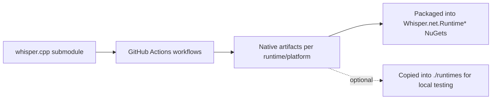

Development guide

This document describes recommended local development setup, including optional devcontainer notes.

Prerequisites
- .NET SDKs: Install 8.0, 9.0, and 10.0 SDKs (matching CI matrices).
- Git (with submodule support) if you plan to build native runtimes from whisper.cpp.
- Platform-specific build tools as needed (Xcode on macOS if working with Apple/CoreML, Android SDK if working with MAUI Android, etc.).

Devcontainer (optional)
- You can use a devcontainer to get a consistent environment for development and CI-parity.
- VS Code users: Install the Dev Containers extension: https://marketplace.visualstudio.com/items?itemName=ms-vscode-remote.remote-containers
- General Dev Containers docs: https://containers.dev/
- Suggested base image: mcr.microsoft.com/dotnet/sdk:8.0 (add 9.0/10.0 SDKs via install scripts or use side-by-side SDK images).
- Recommended components to include:
  - dotnet SDKs: 8.0, 9.0, 10.0
  - git, cmake, ninja, build-essential (Linux)
  - Android SDK/NDK if building MAUI Android or native Android runtimes
  - Optional: Vulkan/CUDA/OpenVINO tools if working on those runtimes
- Cache nuget packages via a mapped host directory (e.g., /home/vscode/.nuget/packages) for faster restores.
- Ensure submodules are initialized if you plan to build native code: git submodule update --init --recursive
- Native runtime download: A devcontainer can include a bootstrap script to download the prebuilt native runtimes into ./runtimes for local testing. See below for a placeholder link.
  - Link: TODO add link to repository devcontainer template (e.g., .devcontainer folder) once published.

Editors and IDEs
- Visual Studio 2026 (Windows/macOS):
  - Download: https://visualstudio.microsoft.com/downloads/
  - Recommended workloads:
    - .NET desktop development
    - Desktop development with C++ (if building native runtimes on Windows)
    - Mobile development with .NET (for MAUI tests/samples)
- JetBrains Rider:
  - Product page: https://www.jetbrains.com/rider/
  - Rider can open this repository directly; use the built-in Unit Tests runner for tests/Whisper.net.Tests.
- VS Code:
  - Install the C# Dev Kit and .NET SDKs, or use the Dev Containers extension above for a preconfigured environment.
  - Test tasks: run dotnet test commands from the integrated terminal or set up tasks.json as desired.

Native runtime usage during development
- Default: Projects resolve native libraries from the published NuGet runtime packages (Whisper.net.Runtime*). This is the easiest path for library and app development.
- Local native builds: If you change native code and want to test locally, see the section “Building The Runtime” for build instructions. Ensure your output layout matches the expected runtimes folders (./runtimes/*) so the loader can probe them.

MAUI/mobile tooling
- Android: Install Android SDK, create an emulator, and optionally use Dotnet XHarness to drive tests. Docs: https://github.com/dotnet/xharness
- iOS (macOS only): Install Xcode, create iOS simulators, use XHarness for automation.

Tips
- Use dotnet workload restore/build to ensure Android/iOS workloads are present when needed.
- Use the tools/WhisperNetDependencyChecker utility to validate runtime prerequisites.


## Architecture & dependency map (development)

```mermaid
graph TD
    Dev[Developer / IDE] --> Build[dotnet build / test]
    Build --> Managed[Whisper.net (managed code)]
    Managed --> Loader[NativeLibraryLoader]
    Loader -->|Probe ./runtimes and NuGet| Native[Native runtimes (CPU/CoreML/CUDA/OpenVINO/Vulkan/NoAvx)]
    Native --> CPP[whisper.cpp + ggml]
```

Notes
- During local development, the loader will first find compatible native libraries either from installed NuGet packages or from your local ./runtimes folder if present.
- The same probing logic is used in CI and production apps.

## CI/workflows as reproducible builders



- You can reuse or adapt the provided workflows under .github/workflows (e.g., dotnet.yml, dotnet-noavx.yml, dotnet-maui.yml) to produce your own native builds.
- Place your custom builds under ./runtimes following the same layout as our packages and the loader will pick them up.

## Using custom native builds
- Whisper.net is agnostic to how the native libraries are produced. Any compatible compilation of whisper.cpp that follows the expected naming and folder layout will work.
- Whisper.net.Runtime is just one published build. Others (CoreML, CUDA, OpenVINO, Vulkan, NoAvx) are also provided, but you can replace or extend them with your own.
- See the section “Building The Runtime” for tool requirements and layout expectations, and refer to the workflows for automated reproduction.

## Building The Runtime

This section describes how to build the native runtime libraries for Whisper.net.
Normally, you would not need to build the runtime libraries yourself, as they are available as NuGet packages.

The build scripts are a combination of PowerShell scripts and a Makefile. You can read each of them for the underlying `cmake` commands being used, or run them directly from the scripts.

You can also check the github actions available [here](https://github.com/sandrohanea/whisper.net/tree/main/.github/workflows)

Notes on required platform build tools (WIP):
- Common tools: CMake (>= 3.24), Ninja (optional but recommended), Git with submodules. TODO: Pin exact minimum versions used in CI.
- macOS: Xcode (latest stable) + Command Line Tools, CMake, Ninja or Make. TODO: Add Homebrew install snippets.
- Linux: build-essential (gcc/g++/make), CMake, Ninja (optional), libstdc++6, glibc 2.31+. TODO: Validate on Ubuntu 22.04/24.04 and document packages per distro.
- Windows: Visual Studio 2026 with "Desktop development with C++" workload, Windows 11/Server 2022 SDK, CMake, and Ninja (optional). TODO: Add vs_BuildTools sku/script example.
- Android (for MAUI/native): Android SDK + NDK r25+; set NDK_PATH accordingly (see below). TODO: Align NDK version with CI matrix.

If you prefer a preconfigured environment, see the Devcontainer notes in DEVELOPMENT.md. VS Code users can use the Dev Containers extension: https://marketplace.visualstudio.com/items?itemName=ms-vscode-remote.remote-containers. TODO: Provide a ready-to-use devcontainer.json with the required tools and a script to fetch native runtimes.

Editors and IDEs
- Visual Studio 2026 (Windows)
    - Download: https://visualstudio.microsoft.com/downloads/
    - Recommended workloads:
        - .NET desktop development
        - Desktop development with C++ (if building native runtimes on Windows)
        - Mobile development with .NET (for MAUI tests/samples)
- JetBrains Rider
    - Product page: https://www.jetbrains.com/rider/
    - Open the solution (Whisper.net.slnx) and use the Unit Tests window to run tests. Rider supports multi-targeting and test discovery for xUnit.
- Visual Studio Code
    - Recommended to use with Dev Containers (link above) for parity with CI; otherwise install the C# Dev Kit and required .NET SDKs.

### Android

`make android`

Before running, create an environment variable for `NDK_PATH` with the path to your Android NDK. For example:

`NDK_PATH=/Users/UserName/Library/Developer/Xamarin/android-sdk-macosx/ndk-bundle`

### Apple

`make apple`

Compiling the Apple libraries requires a Mac with Xcode installed. TODO: Document required Xcode version(s) and how to install Command Line Tools.

### Apple CoreML

`make apple_coreml`

Compiling the Apple libraries requires a Mac with Xcode installed.

### Linux

`make linux`

Prereqs: gcc/g++/make (build-essential), CMake, Ninja (optional). TODO: Add apt/yum/pacman examples.

### Windows

Import the PowerShell module:

`Import-Module ./windows-scripts.ps1`

Run `BuildWindowsAll` to build all Windows libraries.
Alternatively, you can run `BuildWindows` with the desired parameters.

```
BuildWindows -Arch "x64" -Configuration "Release"  -NoAvx $true
```

Native runtime downloads via Devcontainer
- For a reproducible setup, you can use a development container to provision toolchains and optionally pre-fetch native runtimes.
- See DEVELOPMENT.md (Devcontainer section) for details and a link to the devcontainer configuration (TODO: add link when available).
